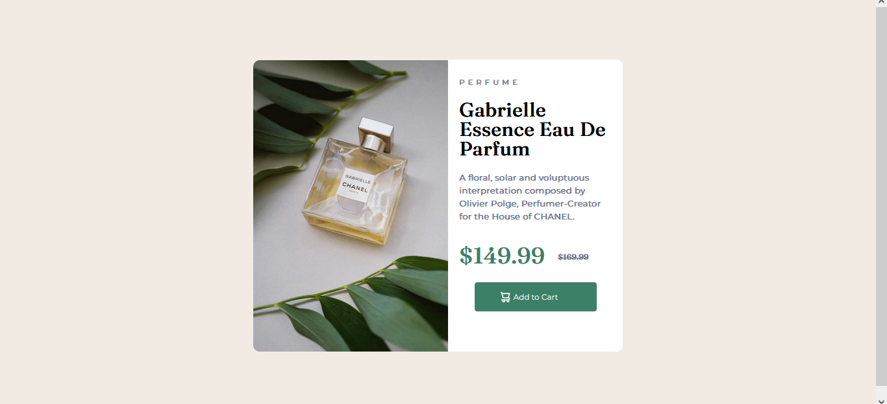

I could call this one of my toughest challenges yet from Frontend mentor because of the troubling facts of responsive manipulations. 

I built this project using flexbox. I learnt a whole lot other new things like, <picture> element, (srcset), and new techniques using border-radius.

This project was built by me, with the help of the net! My favorite reliable source of info. Cheers.

### Screenshot

### Challenges

I faced a lot of challlenges with this project. - - The first challenge was with the two different images.
- The second was with the responsiveness.
- The third was with the width, heights and othe minor things causing complications.